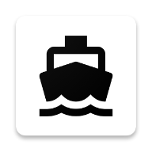
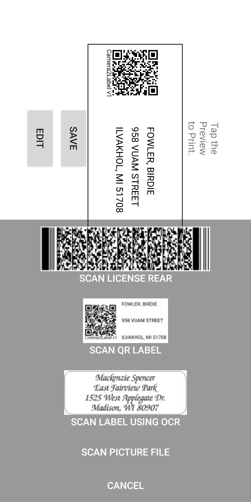
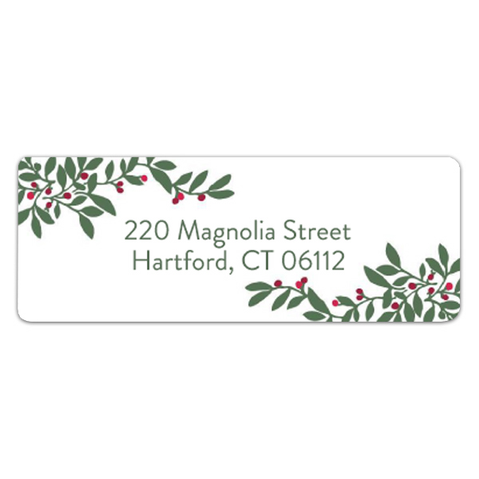
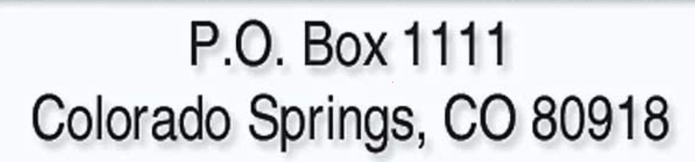
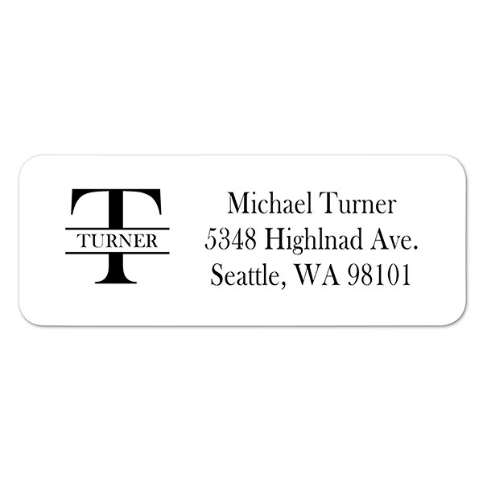
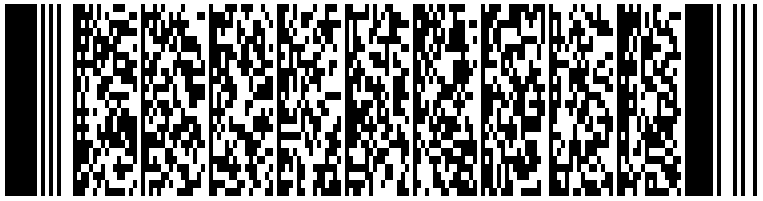

# Camera2Label 

**Use your phone camera to build labels from Driver's Licenses, or existing labels**

Camera2Label supports generating, saving and printing labels from Driver's Licenses, Camera2Label Labels, or existing labels.

# Development Overview

This is a Native Android application targeting SDK version 19 or higher (Android 4.4)

## Developer Setup

A full gradle project is provided but there are dependencies that are not bundled.
**Dependencies:** [Brother Print Library](https://developerprogram.brother-usa.com/sdk-download)

# Sample files used for testing.

## 2-Lined Labels

## 3-Lined Labels

## 4-Lined Labels

## License Rear - PDF417

