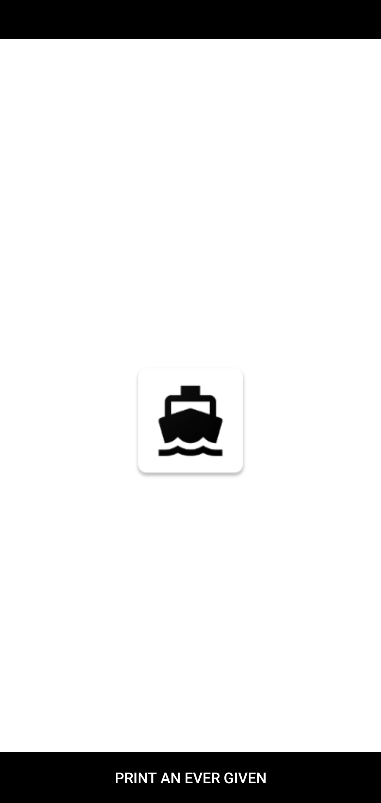

# Ever Given Forever

**Use your phone to print a reminder that Ever Given was stuck for 5 days on your QL-820NWB printer using DK-1201 labels**

# Development Overview

This is a Native Android application targeting SDK version 19 or higher (Android 4.4)

## Developer Setup

A full gradle project is provided but there are dependencies that are not bundled.
**Dependencies:** [Brother Print Library](https://developerprogram.brother-usa.com/sdk-download)

